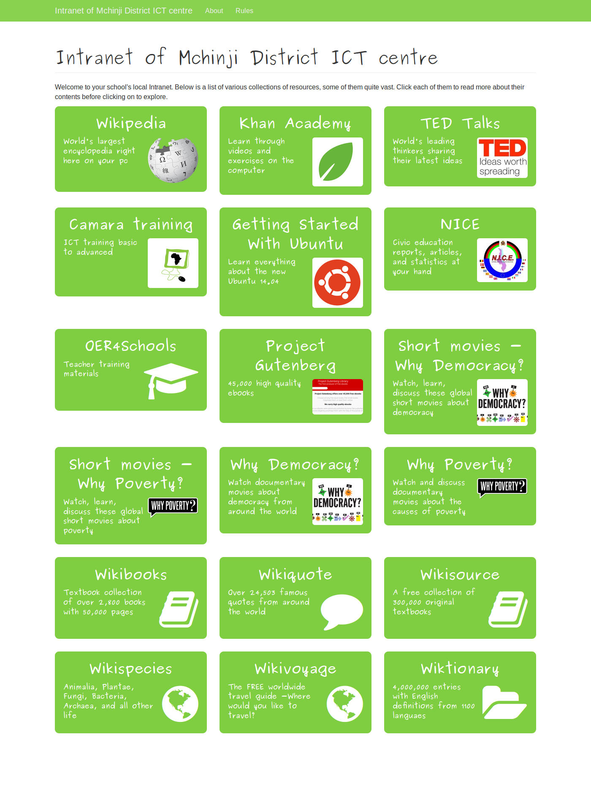

fair-ubuntu-centre
==================

This project automatically configures a server for a Digital Library.
Client computers for students/users are then installed through PXE netboot.
The server contains a number of offline educational resources, together with
the full Ubuntu software repositories.

For more information, please refer to the documentation:

[http://fair-ubuntu-centre.readthedocs.org/](http://fair-ubuntu-centre.readthedocs.org/)

